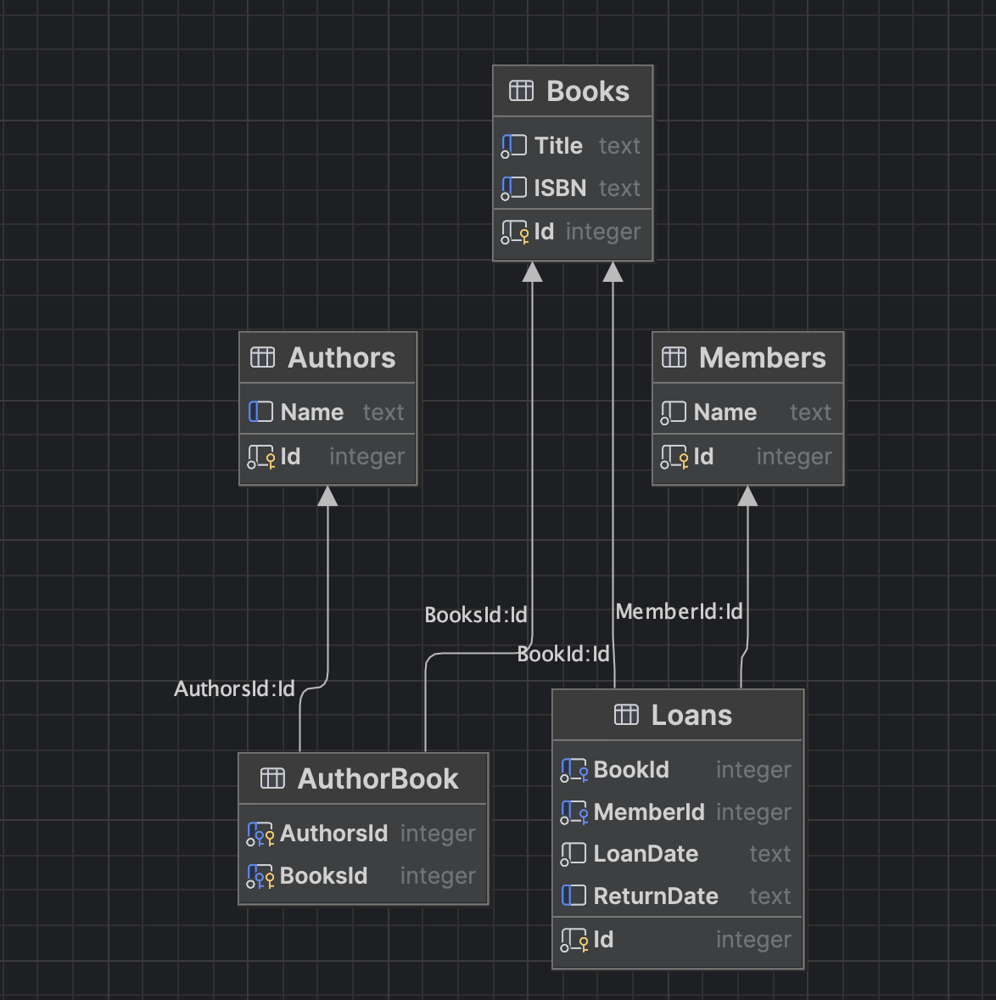
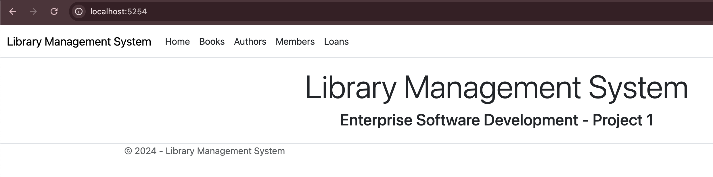
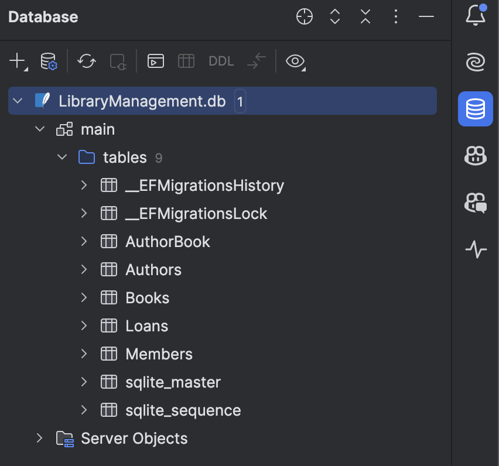
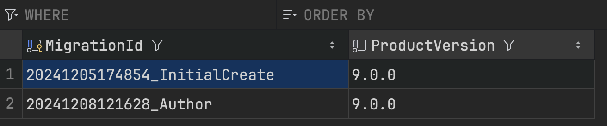

## Introduction

In this project, we will work on a simple library management system. This is an MVC application written in C#, using asp.net core and entity framework core for persistence in a SQLite database.

C# is an excellent OOP language and efcore is one of the best ORMs available for enterprise software. Students are not expected to be familiar with either of them and code template already takes care of the parts which require some knowledge of these technologies. Instead, students will perform following:

- See example of a clean domain layer and implement some business logic in domain layer.
- See example of MVC architecture and create new model, view and controller for an entity.
- Use entity framework and database context to fetch data from data layer.
- Modify database structure without losing data by generating and applying a migration.

### Domain Layer

This system has three domain entities:

- `Book`
- `Member`
- `Loan`

A book or a Member can be added, updated, listed or deleted. One book may be loaned to only one member at a time and a member cannot loan more than three books at a time. We record whenever someone Loans a book and save the return date whenever they return the book.

There is a fourth entity `Author` which students will add themselves. A `Book` may have multiple authors and an `Author` may have written multiple books.

A service `LoanService` is responsible for loaning a book to a member and creating appropriate `Loan` records.
### Data Layer

The database engine we use is SQLite and its automatically created at the startup. The final DB structure should look like this:

Data layer uses Entity Framework which is an ORM/Data Mapper provided by Microsoft for dotnet platform. Entity Framework maps our domain objects to the configured database and automatically creates it and provides us helper methods to fetch data without writing any SQL.

### Controllers

There are controllers corresponding to each domain entity defined above, though that is by accident and not always true when we work on large systems. The controllers fetch data from data layer, run some functionality on domain objects and pass data to views in presentation layer.

### Presentation Layer

We utilize Razor Views, which are a combination of basic HTML + some templating. We get some object from controller in these views and we display that object's properties in HTML. No business logic should be handled in these views since they are purely for presentation.
## Project Setup

### Getting Project Files

Just clone the repository and start committing your changes to your own repository. You are expected to be familiar with git and github. If you are not, please follow some tutorials on git and github.

### IDE Setup

Instructor's personal recommendation is [Rider](https://www.jetbrains.com/rider/) but students may also work on Visual Studio Code with C# Dev Kit extension. When using Visual Studio Code, students may want to utilize Dev Containers as described below to speed up the setup.
### Manual Setup
#### Dotnet

Install dotnet framework 9.0 from here: https://dotnet.microsoft.com/en-us/download. Then run `dotnet workload update` (may require privilege escalation) followed by `dotnet tool install --global dotnet-ef` to install entity framework cli tools.
### Dev Containers

Documentation: https://code.visualstudio.com/docs/devcontainers/containers

There is a `Dockerfile` and `devcontainers.json` file for your convenience. Install Docker Desktop and Visual Studio Code. Then make sure VSCode has Dev Containers Extension installed. You can start a dev container by doing `CTRL + P` or `CMD + P` and typing `> Dev Containers: Reopen In Container`. This should give you all you need to start working on the project.

Dev containers can also be started in Rider but that has not been tested by the instructor.

## Running Project

Switch to `LibraryManagementSystem` project directory and run `dotnet restore`. This should give you all packages required to run the project. Then you can run `dotnet run` in this directory or use IDE's play button to start the project.

Project should look like this on browser:

## Part 1: Update Domain Logic (2 Points)

1. In `Domain/Book.cs` implement `IsAvailable()` functionality.
2. Open `Domain/Member.cs` and implement `CanBorrow()` functionality.
3. Open `Domain/Services/LoanService.cs` and implement missing parts in `LoanBook()`.
4. In `Domain/Author.cs`, add fields and implement `BooksToString`.
5. In `Domain/Book.cs` implement `AuthorsToString()` function.

Remove all `TODO` comments in these files.

Commit and push your changes.

## Part 2: Update Data Layer (5 Points)

The database is an SQLite database in a file and can be explored in any SQLite viewer. In JetBrains Rider, if set up correctly, it appears as following:

You can use following connection string:

`jdbc:sqlite:LibraryManagementSystem/LibraryManagement.db`

Notice `__EFMigrationsHistory` table above, it has a record for `InitialCreate`. There is a file with suffix `InitialCreate.cs` in your project's `Migrations` directory. This file is auto generated by entity framework based on the domain models we map in `LibraryContext` class in `Data` directory.

The current table in database for `Authors` only has an `Id` and `CreatedAt` and a `BookId` foreign key. We want to update the database to reflect new fields we added to our `Author` domain model and also associate many authors with many books by creating foreign keys.

6. Run the following command in `LibraryManagementSystem` directory on terminal:
   `dotnet ef migrations add Authors`. This should create a new file in `Migrations` directory with `Authors.cs` suffix and make some changes to `LibraryContextModelSnapshot.cs`.

We just create a database migration. Entity framework tracks the current database structure in `LibraryContextModelSnapshot.cs` . If your domain models change, it can deduce the changes by comparing them with what it had in snapshot and generate a migration class with only the needed changes. You can see these changes in the new migration file. When applied to a database, this updates structure of your database without recreating the database or losing data.

Stop and start the app again as described above. This will apply the new migration to the database. Check the SQLite database to ensure it has new columns and foreign keys now. It will also have a `AuthorBook` table to track many-to-many relationship between `Book` and `Author`.

You may use `dotnet ef migrations remove -f` to revert some migration and retry if you make a mistake.

7. Take a screenshot of `__EFMigrationsHistory` table data and save it as `migration_authors.png` in `screenshots` directory and commit it.

Here is an example:

8. Add indexes as described in `OnModelCreating` function in `LibraryContext` class and create another migration by running `dotnet ef migrations add Indexes`.
9. Restart app and check `__EFMigrationsHistory` table again. There should be an entry for `Indexes` migration. Save a screenshot of table data as `migration_indexes.png` in `screenshots` directory and commit it.

## Part 3: Add Controller Changes (2 Points)

Controllers validate the input from presentation layer, fetch or update the domain objects in data layer then pass the required data to views. In a sense, they are glue between presentation layer and other parts of the application.

10. Open `BooksController` and include `Authors` navigation property in `Books()` action's query. This joins the books with authors and fills in the data. Note that you did not have to do many-to-many join using SQL.
11. Add functionality in `AuthorsController`. You may refer to `MembersController` as that is very similar to what we want for `AuthorsController`.

At this stage, run all tests in `LibraryManagementSystem.Tests` directory and ensure they all pass before proceeding.

## Part 4: Add Views(1 Points)

We have everything we need to finally present our app to the user. We do that using Razor Views defined in `Views` directory.

12. Open `Views/Authors/Authors.cshtml` and make changes.
13. Open `Views/Authors/add.cshtml` and make changes.
14. Open `Views/Authors/update.cshtml` and make changes.

## Running Tests

For your convenience, there are tests provided in `LibraryManagementSystem.Tests` project.
These are not exhaustive and passing tests do not necessarily mean that you get full marks so do your due diligence and manual testing.
A workflow also runs these tests on github actions and you can see the results in the Actions tab of your repository.

To run tests, ensure all dependencies are restored using `dotnet restore` command in `LibraryManagementSystem.Tests` directory then run `dotnet test`.

On GitHub, a workflow is triggered on every push to main branch. Make sure to check the results of this workflow to see if your changes pass the tests.

## Final Sanity Check

Open the app and verify following:
- Add, update, delete works for Books.
- Multiple authors can be selected while adding or updating a book.
- Book authors are listed properly.
- Add, update, delete works for Authors.
- Author books are listed properly.
- You can loan a book to a member.
- Loan fails if a book is already borrowed to someone.
- Loan fails if member already has borrowed 3 books.
